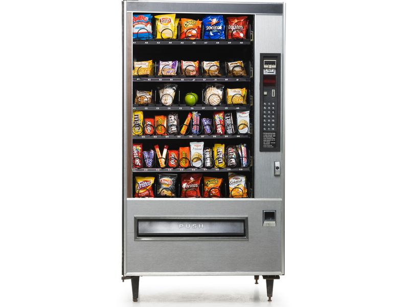
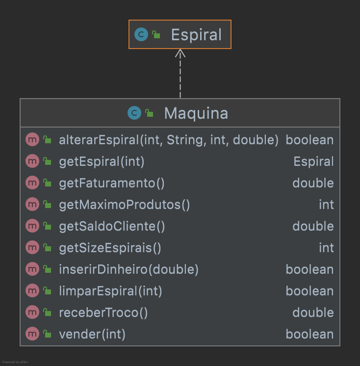

# JunkFood


Máquinas de junk food só servem para duas coisas, não só vender comidas que fazem mal para saúde, como também, rejeitar as notas velhas que você tem.

O objetivo dessa atividade é implementar uma classe responsável por uma máquina de vender JunkFood. Na máquina existem várias espirais. Diante disso, uma espiral contém uma certa quantidade de produtos do mesmo tipo e mesmo preço. O usuário insere o dinheiro, compra o produto e recebe o troco.


- [Requisitos](#requisitos)
- [Diagrama](#diagrama)
- [Exemplo de execução](#exemplo-de-execução)
- [Relatório de Entrega](#relatório-de-entrega)


## Requisitos

- Inicializando a máquina
  - Iniciar a máquina definindo o número de espirais e a quantidade máxima de produtos em uma espiral.
- Inicializar uma espiral
  - Para iniciar uma espiral vazia coloque um " - " no nome do produto para informar que não há produto definido
  - A quantidade de produto e o preço devem estar zerados.  
- Definir produto na espiral
  - Verifique se a espiral informada existe na maquina.
  - Difinir quais produtos há em cada espiral passando o nome do produto, a quantidade e o preço buscando a espiral com o índice correspondente.
  - Se a quantidade de produtos excerder a quantidade máxima que a espiral suporta, não defina os produtos na espiral.
- Resetar uma espiral
  - Limpar todas as informações da espiral voltando ao seu estado original buscando apenas com o índice correspondente.
    - Ao vender todos os produtos na espiral, deve ser possível limpar todas as informações na espiral voltando ao seu estado original.
- Inserir Dinheiro
  - Adicione o dinheiro na espiral.
    - Abstraia como o dinheiro será inserido na máquina. Crédito, débito, bitcoin, cédula nova ou velha, ficha de fliperama. Portanto, tudo será válido.
    - Receba o dinheiro do usuário e adicione ao saldo.
- Vender Produto
  - Permita que o cliente possa comprar um produto de uma espiral.
    - Verifique se produto existe na espiral informada com o índice e se o valor do pagamento é suficiente.
- Receber Troco
  - Permita que o cliente possa receber o seu troco.
- Visualizar Faturamento
  - Deve ser possível ver o faturamento total da máquina.

## Diagrama


## Exemplo de execução 
```java
public class Runner {

    public static void main(String[] args) {

        Maquina maquina = new Maquina(3, 5);
        System.out.println(maquina);
        /*
            saldo: 0.0
            0[  -  : 0 U : 0.0 RS]
            1[  -  : 0 U : 0.0 RS]
            2[  -  : 0 U : 0.0 RS]
        */

        maquina.alterarEspiral(2, "Ruffles", 4, 5.25);
        maquina.alterarEspiral(1, "Doritos", 2, 4.50);
        maquina.alterarEspiral(0, "Sensações", 1, 7.00);
        System.out.println(maquina);
        /*
            saldo: 0.0
            0[ Sensações : 1 U : 7.0 RS]
            1[ Doritos : 2 U : 4.5 RS]  
            2[ Ruffles : 4 U : 5.25 RS] 
        */

        maquina.inserirDinheiro(6.00);
        if(!maquina.vender(0)){
            System.out.println("fail: não foi possível comprar o item, saldo insuficiente.");
            //fail: não foi possível comprar o item, saldo insuficiente.
        }

        maquina.inserirDinheiro(3.25);
        maquina.vender(0);
        System.out.println(maquina);
        /*
            saldo: 2.25
            0[  -  : 0 U : 0.0 RS]
            1[ Doritos : 2 U : 4.5 RS]
            2[ Ruffles : 4 U : 5.25 RS]
        */

        if(!maquina.vender(0)){
            System.out.println("fail: não foi possível comprar o item, espiral sem produtos.");
            //fail: não foi possível comprar o item, espiral sem produtos.
        }

        maquina.inserirDinheiro(7.50);
        maquina.vender(2);
        System.out.println(maquina);
        /*
            saldo: 4.50
            0[  -  : 0 U : 0.0 RS]
            1[ Doritos : 2 U : 4.5 RS]
            2[ Ruffles : 3 U : 5.25 RS]
        */

        if(!maquina.vender(4)){
            System.out.println("fail: não foi possível comprar o item, espiral não encontrada com o índice informado.");
            //fail: não foi possível comprar o item, espiral não encontrada com o índice informado.
        }

        double troco = maquina.receberTroco();
        System.out.println(troco);
        // 4.50

        double faturamento = maquina.getFaturamento();
        System.out.println(faturamento);
        // 12.25
    }  
}
```

## Relatório de Entrega

Não esqueça de preencher o seguinte formulário [Link para formulário](https://forms.gle/7SEpGBK9fjV9rxj49) ao completar a atividade.
